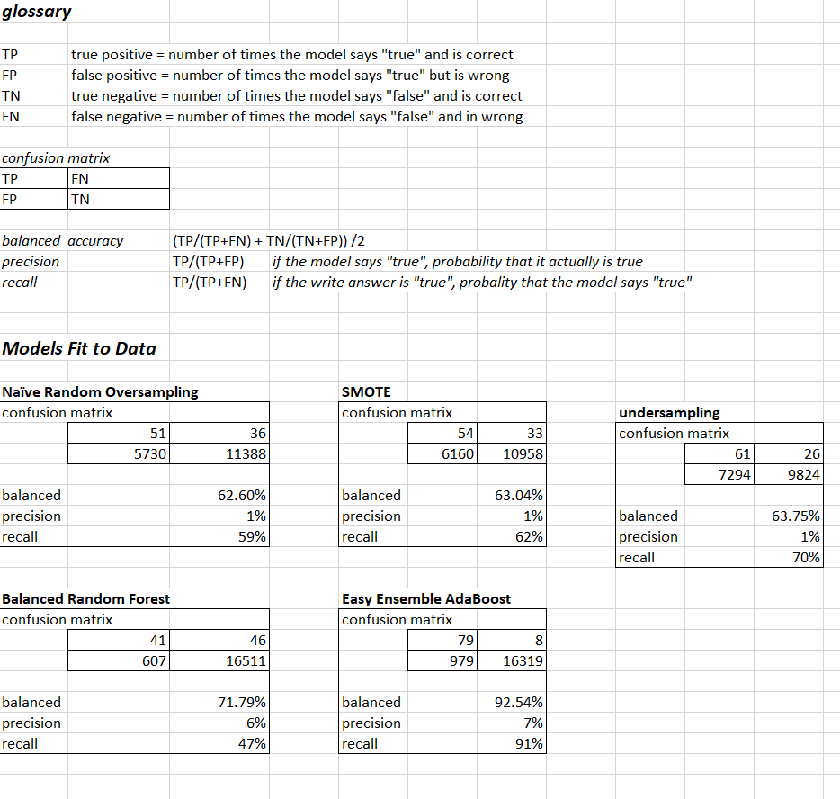

# Credit_Risk_Analysis
## Overview

There are many different machine learning models, each with a different underlying statistical method, to analyze existing data and come up with predictions. If a model tests well to past data regarding credit card payments, it may be worth adapting as a factor in future credit decisions.

I have looked at about 60,000 records of actual data, and split these into a "learning" set used to calibrate a model, and a "test" set, used to test the accuracy of the predictions made.

For all the models, usefulness is guaged in terms of 
- how many times the model correctly predicted a "true" value, which for this exercise means a high risk loan
- how many times it incorrectly predicted a "true" value
- how many times it correctly predicted "false) (i.e. no credit issues)
- how many times it incorrectly predicted "false"

This analysis is complicated by the fact that the vast majority of loans made do not result in credit problems. So a model that simply predicted "no problem" would be pretty accurate on average, but useless for our purposes. All the model used make some attempt to deal with the fact that the actual data is "unbalanced" - there are far more good loans than bad loans in the data.

The following table has the resulting numbers from each model, as well as a glossary of the terms used.

## Summary of results

## Conclusions and Recommendations

The problem that jumps out with all of the models is the false positives - in some cases; in the testing data, there are only 87 troubled loans, but based on these models, we would be turning down thousands of applicants. From that point of view, we would be best off with the Balanced Random Forest - it produced about 600 false positives, so would result in declining about 3.5% of the applicants - still alot, but better than all the other models.

The Easy Ensemble ADABoost had the second best measure in that regard, and also did a better job in eliminating false negatives; Balanced Random Forest missed 46 problems, and the Easy Ensemble missed only 8. This is reflected i the "recall" measure as well as in the raw numbers in the confusion matrix.

The choice between these two models is a balancing act: is it worth denying an extra 400 loans to prevent about 40 troubled accounts? If so, Easy Ensemble AdaBoost looks good. Otherwise, go with Balanced Random Forest.

